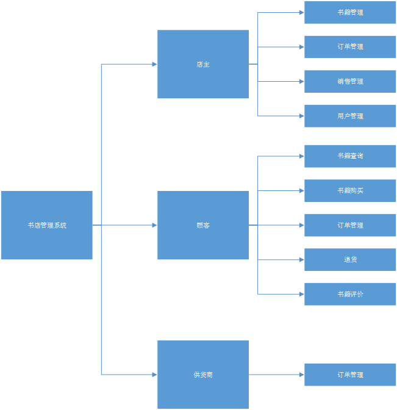
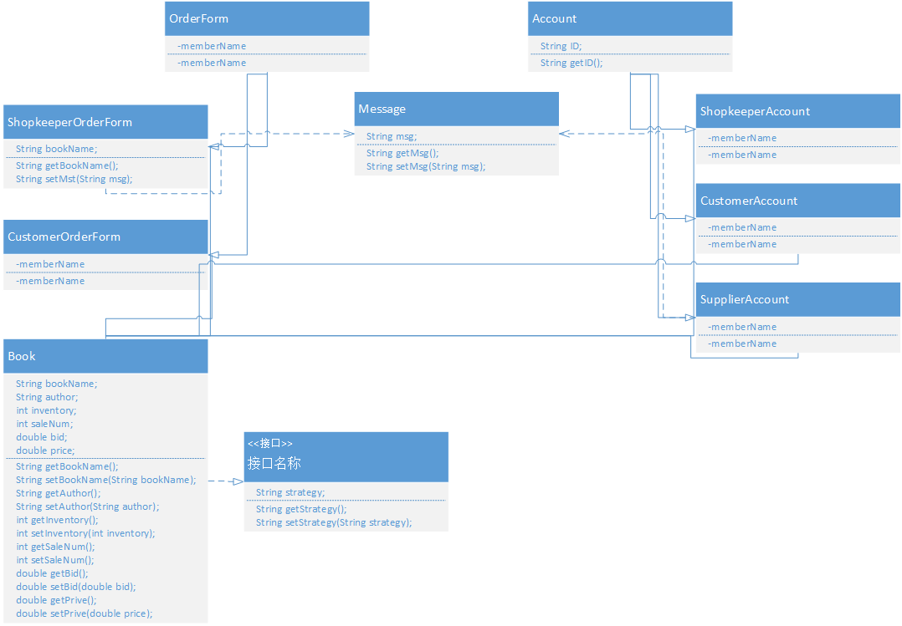
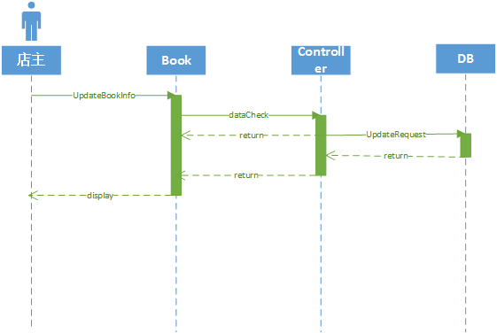
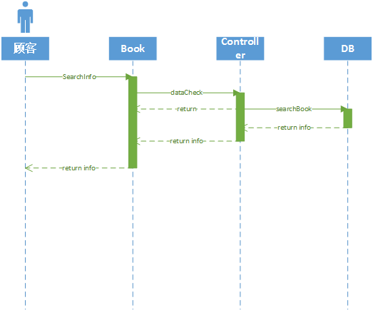
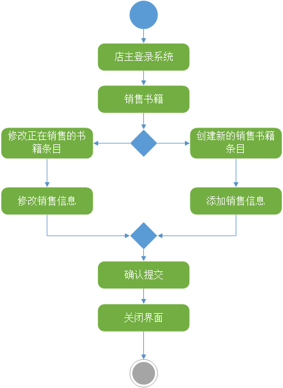
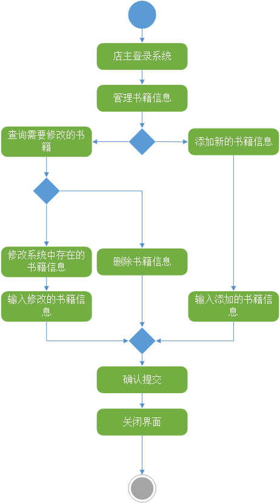
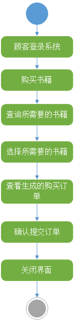
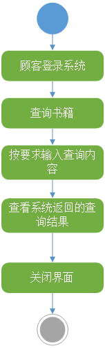
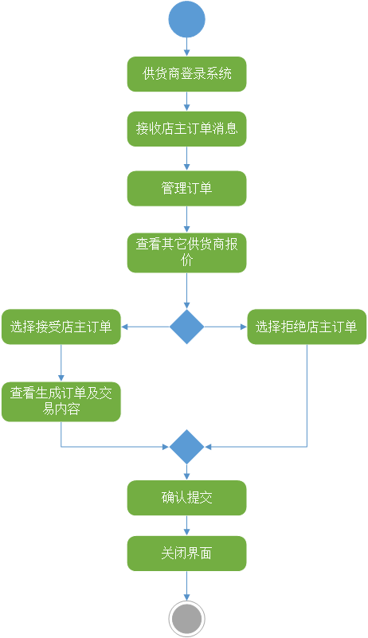

# 书店管理系统系统分析报告

#### Homework 2: 案例设计

Link: [案例设计报告](https://github.com/isph/OO/blob/master/Docs/%5B%E4%BD%9C%E4%B8%9A2%5D%E6%A1%88%E4%BE%8B%E8%AE%BE%E8%AE%A1%E6%8A%A5%E5%91%8A.pdf)

#### Homework 3: 业务目标与涉众分析

Link: [业务目标与涉众分析报告](https://github.com/isph/OO/blob/master/Docs/%5B%E4%BD%9C%E4%B8%9A3%5D%E4%B9%A6%E5%BA%97%E7%AE%A1%E7%90%86%E7%B3%BB%E7%BB%9F%E6%B6%89%E4%BC%97%E5%88%86%E6%9E%90%E6%8A%A5%E5%91%8A.pdf)

#### Homework 4: 书店管理系统需求分析报告

Link: [书店管理系统需求分析报告](https://github.com/isph/OO/blob/master/Docs/%5B%E4%BD%9C%E4%B8%9A4%5D%E4%B9%A6%E5%BA%97%E7%AE%A1%E7%90%86%E7%B3%BB%E7%BB%9F%E9%9C%80%E6%B1%82%E5%88%86%E6%9E%90%E6%8A%A5%E5%91%8A.md)

***
***

## 1. 系统概述

本系统为一套能够在线销售书籍的书店管理系统, 涉及的主要参与者为书店店主, 顾客和书店书籍供货商, 系统需要满足甲方提出的相关需求. 

系统建设的总体目标是首先完成书店管理系统的各项功能性需求, 同时尽可能完成相关的非功能性需求, 提高书店进货与售书等交易流程的信息化.

|项目|描述|
|:----:|:----:|
|软件名称|书店管理系统|
|项目委托|XX书店|
|开发单位|北京大学面向对象分析与设计课程A组成员|
|项目用户|XX书店店主/顾客/供货商|

### 1.1 文档目的

为明确书店管理系统的系统结构, 安排项目规划与进度, 指定详细开发计划, 组织软件的开发和测试, 特撰写本文档. 本文档供客户, 设计人员, 开发人员等参考.

### 1.2 文档约定

* 本文档的描述内容是书店管理系统的系统分析报告.
* 本文档中设计的各项功能需求来源于系统需求分析报告.
* 本文档采用基于UML建模语言的面向对象建模方式对系统的功能进行结构设计.
* 功能需求的小节按照需求分析报告中的基本用况进行排序.
* 系统的结构设计由动态结构和静态结构组成, 且静态结构通过动态结构汇总得到.
* 系统的动态结构由以下方面组成:
    - 每个基本用况及其子用况, 对应有一张系统顺序图.
    - 用况实现的设计就是说明系统顺序图中的每个系统事件, 进入软件系统后由哪个软件对象接收, 并由哪些其他的软件对象协同工作, 按照需求分析报告说明的要求返回规定的结果给使用者.
    - 每个系统事件的交互图使用UML的顺序图表示某一时刻软件对象的交互实例.
    - 系统顺序图中有过多少个系统事件, 该用况实现的交互图就有多少个.
    - 每个系统事件有明确的方法和参数定义.
* 系统的静态结构由以下方面组成:
    - 系统的静态结构主要由软件类及其之间的关系表示, 即类图; 软件类之间的关系主要使用定向关联(表示一个软件类的方法调用另一个软件类的方法), 在明确两个类之间有相互调用的情况下使用双向关联.
    - 系统结构过于复杂的情况下, 通过包图的方式描述系统的宏观静态结构, 包图主要使用依赖关系表示包和包之间的调用关系.

### 1.3 预期的读者和阅读建议

|编号|预期读者|阅读建议|
|:----:|:----:|:----:|
|1|客户|确认文档中给出的功能需求描述|
|2|开发方|熟悉并掌握项目的各项功能需求|

### 1.4 系统的范围

### 1.5 参考文献

1. Homework 2: 案例设计
2. Homework 3: 业务目标与涉众分析
3. Homework 4: 书店管理系统需求分析报告
4. <<大象-Thinking in UML>>(第2版)-谭云杰著
5. <<面向对象的分析与设计>>-邵维忠 杨芙清著

***
***

## 2. 系统分析

### 2.1 系统用况

|项目|描述|
|:----:|:----:|
|用况编号|UC_01_01|
|参与者|店主|
|用况名称|在线销售书籍|

|项目|描述|
|:----:|:----:|
|用况编号|UC_01_02|
|参与者|店主|
|用况名称|修改书籍信息|

***

|项目|描述|
|:----:|:----:|
|用况编号|UC_02_01|
|参与者|顾客|
|用况名称|购买书籍|

|项目|描述|
|:----:|:----:|
|用况编号|UC_02_02|
|参与者|顾客|
|用况名称|查询书籍信息|

***

|项目|描述|
|:----:|:----:|
|用况编号|UC_03_01|
|参与者|供货商|
|用况名称|处理订单|

### 2.2 用况描述

|项目|内容|
|:----:|:----:|
|用况名称|在线销售书籍|
|用况描述|书店店主选择在线销售的书籍并设置销售价格|
|执行者|店主|
|前置条件|店主成功登录系统且有书籍存货|
|后置条件| 创建新的销售书目并设置销售价格.  |
|主事件流描述| 1. 店主选择在线销售的书籍, 修改销售条目, 执行2; 店主选择新的销售书目, 创建销售条目, 执行3.   2. 店主选择正在销售的书籍, 计算机展示销售书籍信息修改界面, 店主输入销售信息, 确认提交.   3. 店主增加新的销售书籍, 计算机展示创建新的销售书籍界面, 店主输入新的销售书籍信息, 确认提交.   4. 计算机校验数据正确性, 如果有不符合的数据内容, 执行分支过程3, 否则执行主过程5.   5. 计算机生成唯一的销售编号.   6.计算机保存销售信息清单.   7. 计算机将销售书籍过程推进至下一环节.   8.计算机向书店店主展示销售信息最终结果, 用况结束.|
|分支事件流描述| 1. 计算机保存当前录入的信息, 生成临时编号.   2. 计算机不保存任何数据, 用况结束.   3. 计算机提示错误数据详细情况, 展示给店主, 并返回主过程|
|异常事件流描述| 1. 店主确认情况有误, 取消返回主过程.|
|业务规则| 1. 店主应当检查正在销售或将要销售的书籍是否还有存货, 如果没有存货店主应该采取相应措施.|
|涉及的实体| 1. 销售信息清单.   2. 书籍信息清单|

|项目|内容|
|:----:|:----:|
|用况名称|修改书籍信息|
|用况描述|书店店主修改系统中已经存在的书籍的相关信息或者增加新的书籍的信息|
|前置条件|店主已经成功登录系统|
|后置条件|系统中的书籍信息被修改或者系统中增加了新的书籍信息|
|主事件流描述| 1. 书店店主选择系统中已经存在的书籍, 修改书籍的信息, 执行2; 选择增加新的书籍信息, 执行3.  2. 计算机展示被选择的书籍的相关信息修改界面, 店主输入修改信息, 确认提交.  3.店主增加新的书籍信息, 计算机展示添加新书信息界面, 店主输入新增信息, 确认提交.  4.计算机校验数据正确性, 如果有不符合的数据内容, 执行分支过程3, 否则执行主过程5. <nr>5.计算机生成唯一的书籍信息标记.  6.计算机保存书籍信息清单.  7.计算机将修改书籍信息过程推进至下一环节.  8.计算机向书店店主展示更新后的书籍信息结果, 用况结束.|
|分支事件流描述| 1. 计算机保存当前录入的信息, 生成临时标记.  2.计算机不保存任何数据, 用况结束.  3. 计算机提示数据错误数据详细情况, 展示给店主, 并返回主过程.|
|异常事件流描述|1.店主确认情况有误, 取消返回主过程.|
|业务规则|1. 店主检查书籍信息是否有误, 如有需要更新或增加的信息则进行修改.|
|涉及的实体|1. 书籍信息清单.|

***

|项目|内容|
|:----:|:----:|
|用况名称|书籍购买|
|用况描述|用户发现自己需要的书籍后, 确认购买该书籍|
|前置条件|顾客成功登陆该系统且系统中有正在销售的书籍|
|后置条件|用户确认购买该书籍, 系统为用户生成订单并展示给用户确认.|
|主事件流描述|1. 顾客选择某一本或者某几本书籍. 2.计算机为用户生成临时订单, 给用户展示所选择的书籍临时订单信息.  3.用户选择确认临时订单展示的内容, 执行过程4, 用户选择取消临时订单展示的内容执行过程5.  4.计算机为用户生成最终交易订单, 并保存结果.  5.计算机取消临时订单并返回主过程.  6.计算机将书籍购买过程推进至下一环节.  7.计算机向用户展示最终交易订单内容及其他相关信息, 用况结束.|
|分支事件流描述|1. 计算机保存顾客当前选择的书籍, 生成临时清单.  2.计算机不保存任何数据用况结束.|
|异常事件流描述|1. 顾客确认情况有误, 取消并返回主过程.|
|业务规则|1. 顾客选择自己需要的书籍并确认选择的内容正确无误.|
|涉及的实体|1. 书籍信息清单.  2.临时交易订单.  3.最终交易订单.|

|项目|内容|
|:----:|:----:|
|用况名称|查询书籍信息|
|用况描述|用户通过系统提供的书籍搜索功能按要求搜索自己需要的书籍, 系统找到相应的结果并返回给用户.|
|前置条件|用户成功登录系统|
|后置条件|系统将用户查找的书籍信息返回并展示给顾客|
|主事件流描述|1. 顾客输入所需要的书籍的相关信息.  2.计算机校验顾客输入数据是否有误, 如果数据正确, 执行主过程3, 如果有错误, 执行分支过程3.  3.计算机对数据库进行检索, 查找顾客需要的书籍信息.  4.计算机返回搜索结果并将结果展示给顾客.  5.计算机保存本次的搜过结果为顾客搜索的历史记录.  6.用户确认获得的结果是否是自己想要的结果, 如果是执行主过程7, 如果不是执行主过程8.  7. 计算机将查询书籍信息推进至下一阶段, 用况结束. 8.系统返回主过程1进行再一次检索.|
|分支事件流描述|1. 计算机保存当前用户输入的信息, 生成记录.  2.计算机不保存任何信息, 用况取消.  3.计算机提示数据错误的详细情况并返回给顾客, 返回主过程.|
|异常事件流描述|1. 顾客确认情况有误, 取消返回主过程.  2.系统校验有误, 系统返回. |
|业务规则|1.顾客按照要求输入自己想要了解和购买的书籍信息进行查询, 最终获得自己需要的内容.|
|涉及的实体|1. 书籍信息清单.|

***

|项目|内容|
|:----:|:----:|
|用况名称|处理订单|
|用况描述|店主通过系统向所有供货商发出订单, 供货商收到订单通知并查看订单内容, 根据供货商自己的情况选择接受或者决绝店主发出的订单.|
|前置条件|供货商成功登陆该系统且店主发出订单|
|后置条件|店主发出的订单被供货商接受或者拒绝.|
|主事件流描述|1. 供货商收到店主发出订单的通知.  2. 供货商查看店主发出的订单信息.  3. 供货商查看其它供货商的出价信息.  4.供货商选择处理订单, 如果供货商选择接受订单转向主过程5, 否则转向主过程6.  5. 计算机保存订单处理的相关信息. 6. 供货商拒绝店主发出的订单, 用况结束.  7.计算机将处理订单流程推向下一阶段, 用况结束.|
|分支事件流描述|1.计算机保存供货商接受订单的相关信息, 生成订单信息.  2.计算机保存供货商拒绝店主的订单信息, 系统返回, 用例结束.|
|异常事件流描述|无|
|业务规则|1. 供货商收到店主发出订单的消息, 同时能够看到其他供货商的出价信息, 供货商可以选择接受或者拒绝店主的订单.|
|涉及的实体|1.店主订单信息.  2.供货商接受订单的新订单.|

### 2.3 业务规则分析

#### 2.3.1 全局规则

1. 用户使用系统必须先登录系统;
2. 系统所有交易订单都应该被存储;

#### 2.3.2 交互规则

1. 顾客查询书籍信息时必须至少填写一项满足要求的内容;
2. 店主更新书籍信息数据必须合法;
3. 顾客查询的书籍信息应当存有历史记录;
4. 店主发布订单需要有信息通知;

#### 2.3.3 内禀规则

1. 每张订单至少要有一件商品;
2. 填写的收货信息等必须是合法的数据;

### 2.4 系统分析类图

### 2.5 系统事件顺序图

|项目|内容|
|:----:|:----:|
|系统事件|修改书籍信息|
|参与者|店主|

***

|项目|内容|
|:----:|:----:|
|系统事件|查询书籍信息|
|参与者|顾客|

### 2.6 系统用况活动图

|项目|描述|
|:----:|:----:|
|用况编号|UC_01_01|
|参与者|店主|
|用况名称|在线销售书籍|

|项目|描述|
|:----:|:----:|
|用况编号|UC_01_02|
|参与者|店主|
|用况名称|修改书籍信息|

***

|项目|描述|
|:----:|:----:|
|用况编号|UC_02_01|
|参与者|顾客|
|用况名称|购买书籍|

|项目|描述|
|:----:|:----:|
|用况编号|UC_02_02|
|参与者|顾客|
|用况名称|查询书籍信息|

***

|项目|描述|
|:----:|:----:|
|用况编号|UC_03_01|
|参与者|供货商|
|用况名称|处理订单|

