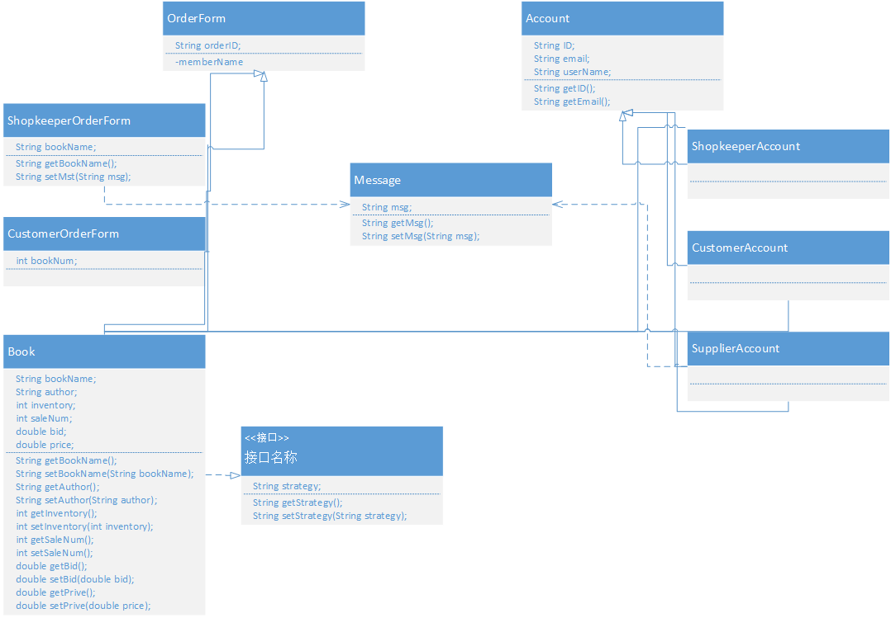

# 书店管理系统系统设计报告

#### Homework 2: 案例设计

Link: [案例设计报告](https://github.com/isph/OO/blob/master/Docs/%5B%E4%BD%9C%E4%B8%9A2%5D%E6%A1%88%E4%BE%8B%E8%AE%BE%E8%AE%A1%E6%8A%A5%E5%91%8A.pdf)

#### Homework 3: 业务目标与涉众分析

Link: [业务目标与涉众分析报告](https://github.com/isph/OO/blob/master/Docs/%5B%E4%BD%9C%E4%B8%9A3%5D%E4%B9%A6%E5%BA%97%E7%AE%A1%E7%90%86%E7%B3%BB%E7%BB%9F%E6%B6%89%E4%BC%97%E5%88%86%E6%9E%90%E6%8A%A5%E5%91%8A.pdf)

#### Homework 4: 书店管理系统需求分析报告

Link: [书店管理系统需求分析报告](https://github.com/isph/OO/blob/master/Docs/%5B%E4%BD%9C%E4%B8%9A4%5D%E4%B9%A6%E5%BA%97%E7%AE%A1%E7%90%86%E7%B3%BB%E7%BB%9F%E9%9C%80%E6%B1%82%E5%88%86%E6%9E%90%E6%8A%A5%E5%91%8A.md)

#### Homework 5: 书店管理系统系统分析报告

Link: [书店管理系统系统分析报告](https://github.com/isph/OO/blob/master/Docs/%5B%E4%BD%9C%E4%B8%9A5%5D%E4%B9%A6%E5%BA%97%E7%AE%A1%E7%90%86%E7%B3%BB%E7%BB%9F%E7%B3%BB%E7%BB%9F%E5%88%86%E6%9E%90%E6%8A%A5%E5%91%8A.md)

***
***

## 1. 引言

### 1.1 编写目的

本文档编写目的是为书店管理系统项目开发提供系统设计规格说明, 主要有以下几条:

* 本文档描述甲方对软件配置和运行环境等的规格说明及与开发人员了解的基础.
* 软件设计和编码的要求, 作为软件开发人员设计和编码的基础.
* 验收标准, 作为客户及用户确认验收的依据.

### 1.2 预期的读者和阅读建议

|编号|预期读者|阅读建议|
|:----:|:----:|:----:|
|1|客户|确认文档中软件具体设计的描述|
|2|开发方|理解并根据系统设计完成软件开发|

## 2. 系统设计

### 2.1 运行环境

|编号|名称|运行环境|
|:----:|:----:|:----:|
|1|应用服务器|Windows|
|2|数据库|Sqlite3|
|3|客户端|Chrome浏览器|

### 2.2 类图设计

#### 类图说明

* OrderForm是订单父类;
* ShopkeeperOrderForm是订单子类, 表示店主发出的订单;
* CustomerOrderForm是订单子类, 表示顾客发出的订单;
* Account是用户账户父类;
* ShopkeeperAccount是账户子类, 表示店主账户;
* CustomerAccount是账户子类, 表示顾客账户;
* SupplierAccount是账户子类, 表示供货商账户;
* Book是书籍类;
* Message是消息类;

### 2.3 数据库表设计

账户数据表

|字段|类型|含义|
|:----:|:----:|:----:|
|ID|string|主键, 用户唯一标识|
|userName|string|用户名|
|password|string|密码|
|email|string|邮箱|

书籍数据表

|字段|类型|含义|
|:----:|:----:|:----:|
|ID|string|主键, 书籍唯一标识|
|bookName|string|书籍名|
|author|string|书籍作者|
|inventory|int|存货量|
|saleNum|int|销售量|
|bid|double|进价|
|price|double|销售价格|

店长订单数据表

|字段|类型|含义|
|:----:|:----:|:----:|
|ID|string|主键, 订单唯一标识|
|bookName|string|书籍名称|
|needNum|int|书籍进货数量|
|bid|double|进货价格|
|time|int|订单有效时间|

顾客订单数据表

|字段|类型|含义|
|:----:|:----:|:----:|
|ID|string|主键, 订单唯一标识|
|bookName|string|书籍名称|
|address|string|住址|
|name|string|姓名|
|phoneNumber|string|电话号码|
|needNum|int|购买书籍数量|
|status|int|订单状态|
|date|int|预计到达时间|
|position|string|书籍当前位置|

### 2.4 硬件配置

服务端

* 处理器(CPU)需Intel(R) Core(TM) i5或具有同等能力的其他处理器;
* 内存RAM>=2G;
* 硬盘容量>=40G;

客户端

* 具有网络连接并可使用主流浏览器(如Chrome & Firefox)的计算机;

### 2.5 软件配置

* 书店管理系统软件采用Python语言实现;
* Web应用框架为Flask;
* 前端采用Bootstrap框架实现;
* 数据库采用Sqlite3实现;
* 运行环境支持Windows & Linux操作系统;
* 客户端支持Chrome & Firefox等主流浏览器;